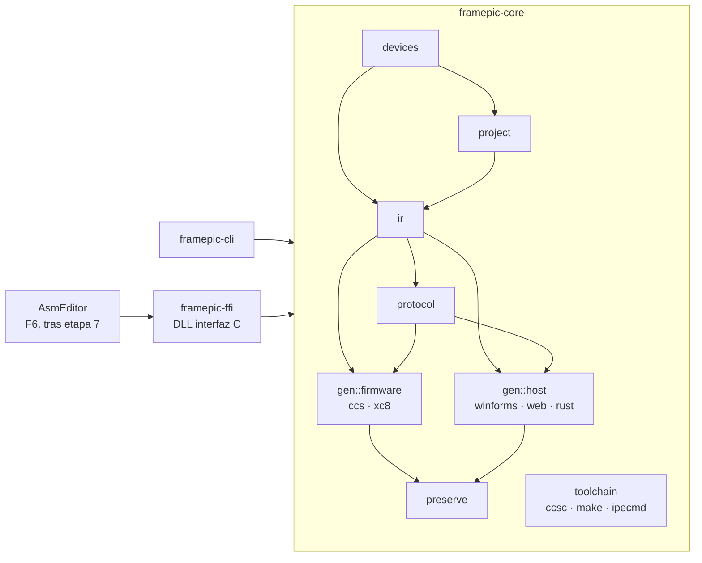
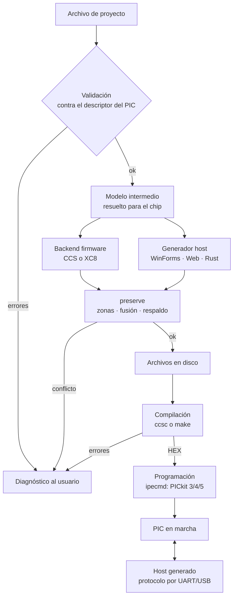

# Frame PIC — Arquitectura (F1)

**Estado:** borrador del paso F1.1 (mapa de componentes y flujo), pendiente del OK de Fabián.
**Fecha:** 28/09/2026

Todo el conocimiento del dominio vive en el núcleo Rust (`framepic-core`). La CLI y la DLL son dos puertas finas hacia el mismo núcleo; AsmEditor solo muestra y llama.

## 1. Componentes

| Componente | Responsabilidad | Depende de |
| --- | --- | --- |
| `core::devices` | Carga y valida los descriptores de PIC (`devices/*.json`): pines, memoria, periféricos, fuses, restricciones | — |
| `core::project` | Modelo del proyecto del usuario y su archivo; reglas de validación contra el dispositivo | `devices` |
| `core::ir` | Modelo intermedio independiente del compilador: qué hay que generar (pines, módulos, protocolo, parámetros), ya resuelto para un chip concreto | `devices`, `project` |
| `core::protocol` | Especificación del protocolo PC↔PIC: tramas, comandos, eventos, tabla de IDs compartida por firmware y host | `ir` |
| `core::gen::firmware` | Backends de firmware: `ccs` (C para CCS 5.0+) y `xc8` (C + proyecto MPLAB X .X) | `ir`, `protocol`, `templates/` |
| `core::gen::host` | Generadores de host: `winforms`, `web`, `rust` | `ir`, `protocol`, `templates/` |
| `core::preserve` | Escritura segura de archivos generados: zonas de usuario, detección, respaldo, fusión a tres vías, historial, huérfanos (R1–R6) | — |
| `core::toolchain` | Invocación de compiladores y programadores: `ccsc`, `prjMakefilesGenerator` + `make`, `ipecmd`; lectura de errores a un formato común | — |
| `framepic-cli` | Ejecutable: `validate`, `generate`, `build`, `program` | `core` |
| `framepic-ffi` | DLL con interfaz C para AsmEditor (F6) | `core` |
| AsmEditor (F6) | Pestaña de diseño, targets de compilación y programación, Lista de errores, paneles | `framepic-ffi` |

## 2. Flujo principal

Reglas del flujo:

- Nada se escribe en disco sin pasar por `preserve`.
- Validación, generación, compilación y programación devuelven diagnósticos en un formato común, que AsmEditor muestra en su Lista de errores.
- El modelo intermedio es el único contrato entre la parte "qué" (proyecto, dispositivo) y la parte "cómo" (backends). Agregar un compilador o un host no toca `project` ni `devices`.

## 3. Decisiones pendientes de F1

Se resuelven en este orden, cada una con su OK:

1. **Integración núcleo ↔ AsmEditor.** Propuesta: DLL con interfaz C (P/Invoke) + CLI.
2. **Formato del archivo de proyecto** y su relación con `.asmproj`.
3. **Contenido del modelo intermedio.**
4. **Motor de plantillas** para los generadores.
5. **Modelo de plugins** para dispositivos, compiladores, hosts y programadores.
6. **Diseño concreto de `preserve`** (R1–R6).
7. **Detección de versión de CCS** y capa de compatibilidad.
8. **Equivalencias CCS ↔ XC8.**
9. **Versionado** del proyecto, del protocolo y de los descriptores.
